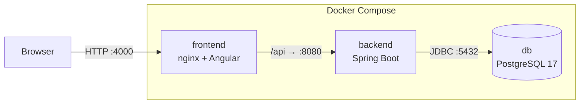
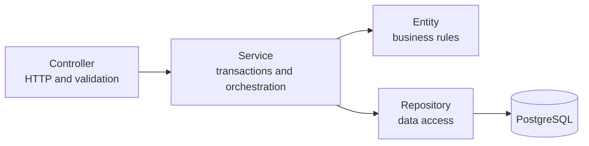

# Faturação

**Invoicing and expense management system for small businesses**, with a Spring Boot API, an Angular frontend and PostgreSQL. The whole system starts with a single Docker command.


> ⚠️ **Demo project.** It follows Portuguese invoicing rules (VAT per rate, invoice series, gapless sequential numbering), but it is **not certified by the Portuguese Tax Authority (AT)** and must not be used for real invoicing.

---

## Table of contents

- [Features](#features)
- [Technical highlights](#technical-highlights)
- [Architecture](#architecture)
- [Try it in 2 minutes (Docker)](#try-it-in-2-minutes-docker)
- [Local development](#local-development)
- [Tests](#tests)
- [API](#api)
- [Project structure](#project-structure)
- [Roadmap](#roadmap)
- [Author](#author)

---

## Features

Built for a service company with 5 to 20 people that wants to track what it bills and what it spends in one place, and see month by month whether it is making money.

| Area | Features |
|---|---|
| **Invoices** | Drafts with dynamic lines, issuing with a sequential number per series and year (`FT 2026/0001`), payment, cancellation with a reason, overdue detection |
| **Expenses** | Recorded from the supplier's document, by category and payment method, with supplier VAT number validation |
| **Catalogue** | Clients (with Portuguese VAT number check-digit validation), products and services with VAT rates (23%, 13%, 6%), categories |
| **Dashboard** | Yearly revenue, expenses and result, receivables, monthly chart, expenses by category and most overdue invoices |
| **Users** | JWT authentication, **Admin** and **User** roles, account management, password change and reset |

---

## Technical highlights

### Gapless sequential numbering under concurrency
Two simultaneous issue requests never get the same number, and a failed issue never leaves a gap in the series.
- **Pessimistic lock** (`SELECT ... FOR UPDATE`) on the series counter: concurrent requests are queued.
- **Optimistic lock** (`@Version`) on the invoice: a double click on *Issue* is rejected instead of consuming two numbers.
- Numbering and issuing run in the **same transaction** (`Propagation.MANDATORY`): if issuing fails, the rollback returns the number to the counter.
- Proven by an **integration test with 20 simultaneous issue requests** against a real PostgreSQL database.

### Rich domain model
Business rules live in the entities, not in the controllers: an issued invoice cannot be changed or deleted, regardless of where the request comes from. The lifecycle (`DRAFT → ISSUED → PAID / CANCELLED`) only moves forward through intention-revealing methods, never through a `setStatus`.

### Money handled with care
- `BigDecimal` and `NUMERIC(12,2)` across the backend, with explicit `HALF_UP` rounding.
- VAT calculated **per line**, not per unit, as in real documents.
- Invoice lines store a **snapshot** of the product (price, VAT rate, description): changing a product never changes past invoices. The same applies to the client's details at issue time.
- In the frontend, the totals preview uses **integer cents** to avoid JavaScript floating-point errors.

### Layered security
- Signed JWT (HS256), **BCrypt** password hashing, secrets kept out of the code (environment variables).
- Access rules centralised in the `SecurityFilterChain`: destructive and tax-relevant operations are restricted to admins.
- **401 / 403** responses in the same `ProblemDetail` format (RFC 9457) as every other API error.
- A single login error message for unknown emails and wrong passwords, so the API does not reveal which accounts exist.

### Performance and data integrity
- `@EntityGraph` to avoid the **N+1 problem**, and `open-in-view` disabled.
- **Dynamic filters** with Specifications, pagination with a maximum page size, and sorting restricted to an allow-list.
- Dashboard **aggregations** (`SUM`, `COUNT`, `GROUP BY`) computed by the database, with indexes on the queried columns.
- **Versioned migrations** with Flyway, and rules also enforced by constraints (`UNIQUE`, `CHECK`, foreign keys).

### Modern frontend
- Angular 22 with standalone components, **signals**, `httpResource` and per-page lazy loading.
- An interceptor attaches the token to every request and ends the session on a 401.
- Reactive forms with `FormArray` and cross-field validators; backend validation errors are shown **on the exact field** (including `lines[0].quantity`).

---

## Architecture



The backend is organised **by feature** (`invoice`, `expense`, `client`, ...), and every feature follows the same layers:



### Stack

| Layer | Technologies |
|---|---|
| Backend | Java 21, Spring Boot 4, Spring Data JPA (Hibernate 7), Spring Security, Bean Validation |
| Database | PostgreSQL 17, Flyway |
| Frontend | Angular 22, Angular Material, RxJS, Chart.js |
| Tests | JUnit 5, AssertJ, Testcontainers, MockMvc, Spring Security Test |
| Infrastructure | Docker (multi-stage builds), Docker Compose, nginx |

---

## Try it in 2 minutes (Docker)

Requirement: **Docker**.

```bash
git clone https://github.com/AndreRodrigues884/faturacao.git
cd faturacao
cp .env.example .env
```

Fill in `JWT_SECRET` (48 random bytes, Base64-encoded) and `ADMIN_PASSWORD` in `.env`. Then:

```bash
docker compose up -d --build
```

Open **http://localhost:4000** and sign in with the `ADMIN_EMAIL` and `ADMIN_PASSWORD` from `.env`.

On the first run, the database is created from the migrations with sample data (clients, products, categories and expenses), together with the first admin account.

| Service | Address |
|---|---|
| Application | http://localhost:4000 |
| API | http://localhost:8080/api |
| PostgreSQL | `localhost:5433` (user and password `faturacao`) |

---

## Local development

Requirements: **JDK 21**, **Node.js 24 LTS** and **Docker**.

```bash
# 1. Database
docker compose up -d db

# 2. Backend (port 8080)
./mvnw spring-boot:run

# 3. Frontend (port 4200, proxying /api to the backend)
cd frontend
npm install
npx ng serve
```

Open **http://localhost:4200**. In development, the admin account is created with the default values from `application.yml`.

---

## Tests

```bash
./mvnw test
```

Docker must be running: the integration tests spin up a disposable PostgreSQL with **Testcontainers**.

| Type | Coverage |
|---|---|
| **Unit** | VAT number validation, VAT calculation and rounding, invoice totals and lifecycle, expense rules. No Spring and no database: they run in milliseconds |
| **Integration** | Issuing against a real PostgreSQL, **20 simultaneous issue requests**, double-click on *Issue*, database constraints |
| **API** | HTTP contract (status codes, headers, `ProblemDetail`), validation, pagination, authentication and authorisation with real JWT tokens |

---

## API

Every endpoint except login requires `Authorization: Bearer <token>`. A Postman collection is available in [`postman/`](postman/).

| Resource | Main endpoints |
|---|---|
| Authentication | `POST /api/auth/login` · `GET /api/auth/me` · `POST /api/auth/change-password` |
| Invoices | `GET /api/invoices` (filters and pagination) · `POST` · `GET/PUT/DELETE /{id}` · `POST /{id}/issue` · `POST /{id}/pay` · `POST /{id}/cancel` |
| Expenses | `GET /api/expenses` (filters and pagination) · `POST` · `PUT/DELETE /{id}` |
| Clients | `GET /api/clients?search=` · `POST` · `GET/PUT/DELETE /{id}` |
| Products | `GET /api/products?includeInactive=` · `POST` · `PUT /{id}` · `DELETE /{id}` (deactivates) · `POST /{id}/activate` |
| Categories | `GET /api/categories` · `POST` · `GET/PUT/DELETE /{id}` |
| Users *(admin)* | `GET /api/users` · `POST` · `PUT /{id}` · `POST /{id}/deactivate` · `POST /{id}/activate` · `POST /{id}/reset-password` |
| Dashboard | `GET /api/dashboard?year=` |

Errors always follow the `ProblemDetail` format:

```json
{
  "status": 400,
  "title": "Dados inválidos",
  "detail": "Um ou mais campos têm valores inválidos",
  "errors": { "lines[0].quantity": "A quantidade tem de ser maior que zero" }
}
```

> The user-facing messages are in Portuguese, as the application targets Portuguese businesses.

---

## Project structure

```
faturacao/
├── src/main/java/pt/andrerodrigues/faturacao/
│   ├── auth/          login, JWT, current user
│   ├── user/          account management
│   ├── config/        security, properties, initial admin
│   ├── common/        errors, pagination, VAT number validation
│   ├── category/      categories
│   ├── client/        clients
│   ├── product/       products, VAT rates
│   ├── invoice/       invoices: domain/, dto/, numbering/
│   ├── expense/       expenses
│   └── dashboard/     dashboard aggregations
├── src/main/resources/db/migration/   Flyway migrations (V1 to V12)
├── src/test/                          unit, integration and API tests
├── frontend/                          Angular application
│   └── src/app/
│       ├── core/      authentication, interceptor, guards, API errors
│       ├── shared/    reusable dialogs and validators
│       ├── layout/    side menu and top bar
│       └── features/  one folder per area (invoices, expenses, ...)
├── docker-compose.yml
└── Dockerfile
```

---

## Roadmap

- [ ] Online deployment with HTTPS
- [ ] Invoice PDF export
- [ ] Credit notes to correct paid invoices
- [ ] Audit trail (who created or changed what)
- [ ] Automatic overdue reminders (`@Scheduled` + email)
- [ ] Expense entry from the receipt's QR code
- [ ] Continuous integration with GitHub Actions

---

## Author

**André Rodrigues** · BSc in Web Information Technologies and Systems (ESMAD, Polytechnic of Porto)

[GitHub](https://github.com/AndreRodrigues884) · [LinkedIn](https://linkedin.com/in/andrerodrigues-dev) · [Portfolio](https://andrerodrigues884.github.io/Portfolio/#/)