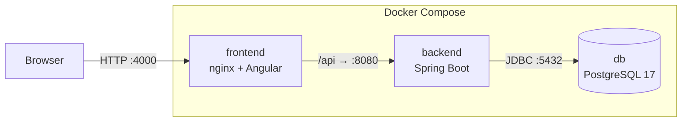
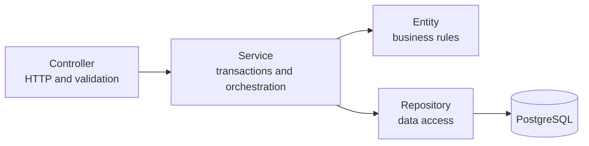

# Saldo

**Invoicing and expense management system for small businesses**, with a Spring Boot API, an Angular frontend and PostgreSQL. The whole system starts with a single Docker command.


> ⚠️ **Demo project.** It follows Portuguese invoicing rules (VAT per rate, invoice series, gapless sequential numbering), but it is **not certified by the Portuguese Tax Authority (AT)** and must not be used for real invoicing.

---

## Demo video

<!-- Replace the line below with the link GitHub generates when you drag saldo.mp4 into the editor -->
https://github.com/user-attachments/assets/REPLACE-WITH-VIDEO-ID

If the player does not load, the video is also available in the repository: [`src/assets/video/saldo.mp4`](src/assets/video/saldo.mp4).

## Overview

### The problem

Small service companies (consultancies, agencies, clinics, training centres) usually keep their finances spread across different places: invoices in one tool, expenses in a spreadsheet, and a vague idea of how much clients still owe. Answering a simple question such as *"are we making money this year?"* means collecting numbers by hand.

**Saldo** brings that information together. A company with 5 to 20 people can manage its clients and catalogue, create and issue invoices, record expenses, and see on a single dashboard how much it billed, how much it spent, what the result is, and which invoices are overdue. The name comes from the Portuguese word for *balance*: what is left once expenses are taken from revenue.

### What you can do

- **Bill clients.** Create invoice drafts with as many lines as needed, choosing products or services and quantities. VAT is calculated per line at the right rate (23%, 13% or 6%) and the totals update as you type. When the draft is ready, it is issued with the next number in the series, such as `FT 2026/0042`.
- **Follow every invoice through its lifecycle.** An issued invoice can be marked as paid or cancelled with a reason, and is never edited or deleted afterwards. Invoices that pass their due date are flagged as overdue, with the number of days late.
- **Record expenses** from the supplier's receipt or invoice, by category and payment method, with the base amount and VAT kept separately.
- **Keep a catalogue** of clients (with Portuguese VAT number validation), products and services with their VAT rates, and expense categories. Products that leave the catalogue are deactivated rather than deleted, so past invoices stay intact.
- **See the business at a glance** on a dashboard with yearly revenue, expenses and result, outstanding and overdue amounts, a month-by-month chart, expenses by category, and the most overdue invoices.
- **Work as a team** with two roles: users handle day-to-day work, while admins can also cancel invoices, delete records and manage accounts.

A **demo account** comes with a fictional company and twelve months of activity (around 70 invoices in every state and more than 100 expenses), so the system can be explored without entering any data.

### How it is built

The backend is a **Spring Boot 4** REST API on **Java 21**, organised by feature, with business rules kept inside the domain entities rather than in controllers. Data lives in **PostgreSQL**, with the schema versioned through **Flyway** migrations and protected by database constraints. The frontend is an **Angular 22** single-page application using signals, reactive forms and Angular Material. Authentication uses **JWT** with BCrypt-hashed passwords and role-based access rules.

The project pays particular attention to the problems that make invoicing software hard to get right: **concurrency** (two people issuing invoices at the same moment must never get the same number), **money** (exact decimal arithmetic and correct rounding), **immutability** (issued documents cannot change, and invoices keep a snapshot of product and client data), and **data integrity** (rules enforced both in the code and in the database).

Everything is covered by a three-level test suite (fast unit tests, integration tests against a real PostgreSQL started by Testcontainers, and HTTP-level API tests) and packaged with **Docker**: multi-stage images for the backend and the frontend, nginx as a reverse proxy, and a Compose file that starts the whole system with one command.

---

## Features

| Area | Features |
|---|---|
| **Invoices** | Drafts with dynamic lines, issuing with a sequential number per series and year (`FT 2026/0001`), payment, cancellation with a reason, overdue detection |
| **Expenses** | Recorded from the supplier's document, by category and payment method, with supplier VAT number validation |
| **Catalogue** | Clients (with Portuguese VAT number check-digit validation), products and services with VAT rates (23%, 13%, 6%), categories |
| **Dashboard** | Yearly revenue, expenses and result, receivables, monthly chart, expenses by category and most overdue invoices |
| **Users** | JWT authentication, **Admin** and **User** roles, account management, password change and reset |
| **Demo** | Optional `demo` profile with a sample company, twelve months of data and a one-click demo login |

## Architecture



The backend is organised **by feature** (`invoice`, `expense`, `client`, ...), and every feature follows the same layers:



### Stack

| Layer | Technologies |
|---|---|
| Backend | Java 21, Spring Boot 4, Spring Data JPA (Hibernate 7), Spring Security, Bean Validation |
| Database | PostgreSQL 17, Flyway |
| Frontend | Angular 22, Angular Material, RxJS, Chart.js |
| Tests | JUnit 5, AssertJ, Testcontainers, MockMvc, Spring Security Test |
| Infrastructure | Docker (multi-stage builds), Docker Compose, nginx |

---

## Try it in 2 minutes (Docker)

Requirement: **Docker**.

```bash
git clone https://github.com/AndreRodrigues884/faturacao.git
cd faturacao
cp .env.example .env
```

Fill in `JWT_SECRET` (48 random bytes, Base64-encoded) and `ADMIN_PASSWORD` in `.env`. Then:

```bash
docker compose up -d --build
```

Open **http://localhost:4000** and click **"Entrar com a conta de demonstração"** to explore the sample company, or sign in as admin with the `ADMIN_EMAIL` and `ADMIN_PASSWORD` from `.env`.

| Service | Address |
|---|---|
| Application | http://localhost:4000 |
| API | http://localhost:8080/api |
| PostgreSQL | `localhost:5433` (user and password `faturacao`) |

## Tests

```bash
./mvnw test
```

Docker must be running: the integration tests spin up a disposable PostgreSQL with **Testcontainers**.

| Type | Coverage |
|---|---|
| **Unit** | VAT number validation, VAT calculation and rounding, invoice totals and lifecycle, expense rules. No Spring and no database: they run in milliseconds |
| **Integration** | Issuing against a real PostgreSQL, **20 simultaneous issue requests**, double-click on *Issue*, database constraints |
| **API** | HTTP contract (status codes, headers, `ProblemDetail`), validation, pagination, authentication and authorisation with real JWT tokens |

---

## API

Every endpoint except login requires `Authorization: Bearer <token>`. A Postman collection is available in [`postman/`](postman/).

| Resource | Main endpoints |
|---|---|
| Authentication | `POST /api/auth/login` · `GET /api/auth/me` · `POST /api/auth/change-password` |
| Invoices | `GET /api/invoices` (filters and pagination) · `POST` · `GET/PUT/DELETE /{id}` · `POST /{id}/issue` · `POST /{id}/pay` · `POST /{id}/cancel` |
| Expenses | `GET /api/expenses` (filters and pagination) · `POST` · `PUT/DELETE /{id}` |
| Clients | `GET /api/clients?search=` · `POST` · `GET/PUT/DELETE /{id}` |
| Products | `GET /api/products?includeInactive=` · `POST` · `PUT /{id}` · `DELETE /{id}` (deactivates) · `POST /{id}/activate` |
| Categories | `GET /api/categories` · `POST` · `GET/PUT/DELETE /{id}` |
| Users *(admin)* | `GET /api/users` · `POST` · `PUT /{id}` · `POST /{id}/deactivate` · `POST /{id}/activate` · `POST /{id}/reset-password` |
| Dashboard | `GET /api/dashboard?year=` |
| Demo *(demo profile only)* | `GET /api/demo/credentials` |

Errors always follow the `ProblemDetail` format:

```json
{
  "status": 400,
  "title": "Dados inválidos",
  "detail": "Um ou mais campos têm valores inválidos",
  "errors": { "lines[0].quantity": "A quantidade tem de ser maior que zero" }
}
```

> The user-facing messages are in Portuguese, as the application targets Portuguese businesses.

---

## Project structure

```
faturacao/
├── src/main/java/pt/andrerodrigues/faturacao/
│   ├── auth/          login, JWT, current user
│   ├── user/          account management
│   ├── config/        security, properties, initial admin
│   ├── common/        errors, pagination, VAT number validation
│   ├── category/      categories
│   ├── client/        clients
│   ├── product/       products, VAT rates
│   ├── invoice/       invoices: domain/, dto/, numbering/
│   ├── expense/       expenses
│   ├── dashboard/     dashboard aggregations
│   └── demo/          sample company and demo login (demo profile only)
├── src/main/resources/db/migration/   Flyway migrations (V1 to V12)
├── src/test/                          unit, integration and API tests
├── frontend/                          Angular application
│   └── src/app/
│       ├── core/      authentication, interceptor, guards, API errors
│       ├── shared/    reusable dialogs and validators
│       ├── layout/    side menu and top bar
│       └── features/  one folder per area (invoices, expenses, ...)
├── docker-compose.yml
└── Dockerfile
```

---

## What I learned

This was my first project with Spring Boot and Angular, built to learn both properly rather than to follow a tutorial. Along the way I worked through:

- Designing a **layered backend** and deciding where each rule belongs, and why business rules are safer inside the entities than in controllers.
- **Transactions and locking** in practice: reproducing a race condition in a test before fixing it, and understanding when to use pessimistic or optimistic locking.
- The pitfalls of **money and dates**: floating-point errors, rounding modes, and time zones that turn the 15th into the 14th.
- **JPA beyond the basics**: lazy loading, the N+1 problem, dirty checking, and when to drop down to the `EntityManager` for aggregations.
- **Security** end to end, from password hashing and JWT validation to the difference between authentication (401) and authorisation (403), and why frontend guards are not security.
- **Testing at three levels** and choosing what each level should prove.
- Shipping software that **anyone can run**, with Docker images, environment-based configuration and secrets kept out of the code.


## Author

**André Rodrigues** · BSc in Web Information Technologies and Systems (ESMAD, Polytechnic of Porto)

[GitHub](https://github.com/AndreRodrigues884) · [LinkedIn](https://linkedin.com/in/andrerodrigues-dev) · [Portfolio](https://andrerodrigues884.github.io/Portfolio/#/)
